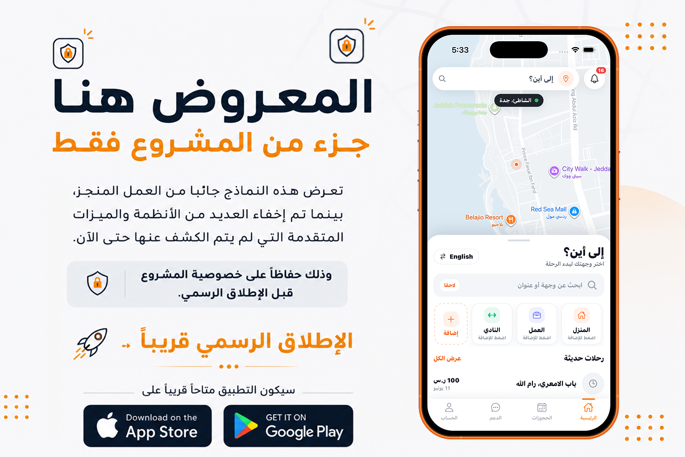
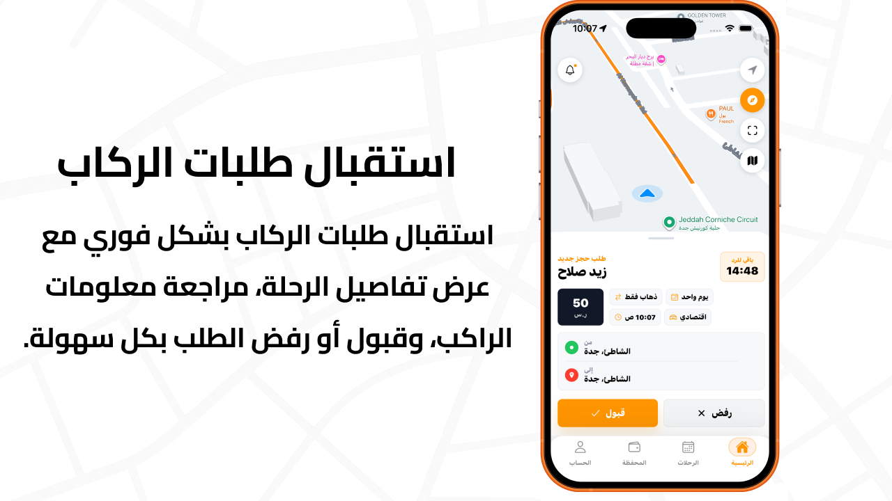
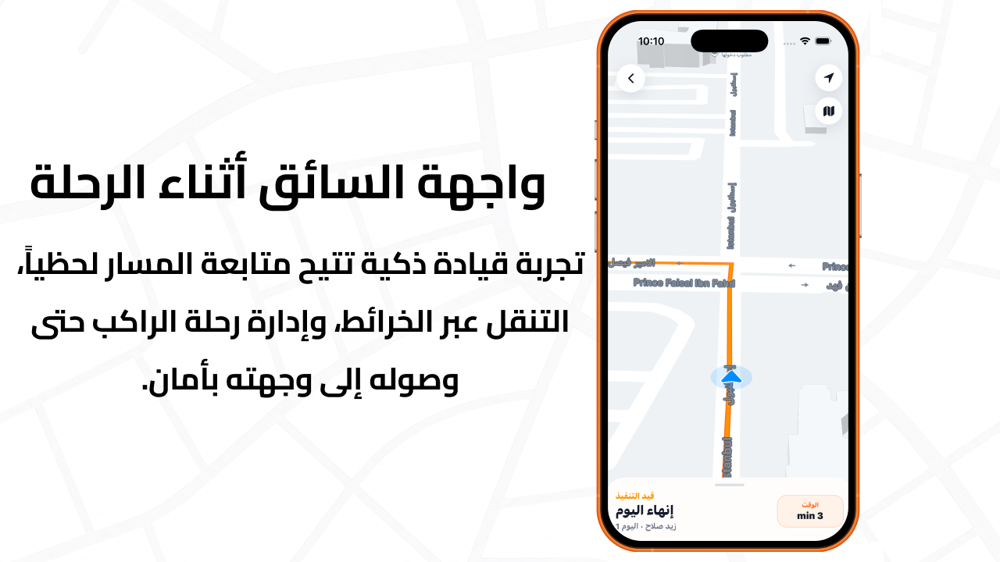

# Drevr

  <strong>A Complete Ride-Hailing Platform Inspired by Uber & Careem</strong>

---

## Passenger Application

  

 

  

 

  

 

  

 

  

---

## Driver Application

  

 

  

---

## Administration Dashboard

  

---

## Overview

Drevr is a complete ride-hailing ecosystem designed to provide a seamless, reliable, and scalable transportation experience for both passengers and drivers.

Inspired by leading mobility platforms such as Uber and Careem, Drevr combines real-time technologies, modern mobile experiences, and a powerful administration system to efficiently manage the entire ride lifecycle.

The platform consists of dedicated mobile applications for passengers and drivers, alongside a comprehensive web-based administration dashboard and a robust backend infrastructure responsible for handling all operational processes in real time.

---

## Platform Components

* Passenger Mobile Application
* Driver Mobile Application
* Administration Dashboard
* RESTful Backend API

---

## Key Features

### Passenger Application

* User authentication and profile management.
* Real-time nearby drivers tracking.
* Instant and scheduled ride requests.
* Live trip tracking and ride status updates.
* In-app chat and push notifications.
* Trip history and ride details.
* Ratings and reviews.
* Multiple payment methods.

### Driver Application

* Receive and manage incoming ride requests.
* Real-time navigation and route guidance.
* Live location sharing during trips.
* Complete trip lifecycle management.
* Earnings tracking and withdrawal requests.
* Availability and online status management.

### Administration Dashboard

* Drivers and passengers management.
* Real-time monitoring of trips and drivers.
* Driver verification and approval workflow.
* Financial operations and reporting.
* Analytics and operational insights.
* Notifications and system management.

---

## Technology Stack

### Mobile

* React Native
* Expo
* TypeScript

### Backend

* Node.js
* Express.js
* PostgreSQL
* Prisma ORM
* Socket.IO

### Services

* Firebase Authentication
* Firebase Cloud Messaging
* Google Maps Platform
* Cloudinary

---

## Architecture

The platform follows a scalable client-server architecture utilizing secure REST APIs and real-time WebSocket communication to ensure reliable trip management, live location tracking, and instant synchronization across all system components.

---

## Status

Development completed and currently undergoing final testing and optimization prior to public release.
